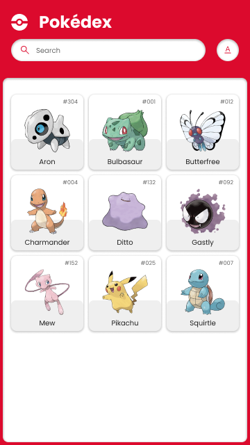
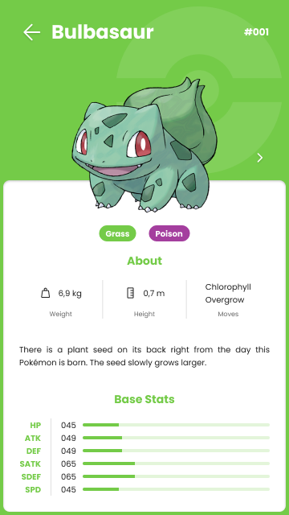

# Jitterbit Pokedex

**Stacks Utilizadas:**

**Back-end:**  
  
  
  
  
  


**Front-end:**  
[](https://angular.io/)  
[](https://www.typescriptlang.org/)  
[](https://rxjs.dev/)  
[](https://tailwindcss.com/)  

**Infraestrutura:**  
[](https://www.docker.com/)  
[](https://docs.docker.com/compose/)

---

## Sumário

- [Descrição Geral](#descrição-geral)
- [Arquitetura](#arquitetura)
- [Tecnologias Utilizadas](#tecnologias-utilizadas)
- [Funcionalidades Principais](#funcionalidades-principais)
- [Execução](#execução)
  - [Execução Local (Sem Docker)](#execução-local-sem-docker)
  - [Execução via Docker (Recomendado)](#execução-via-docker-recomendado)
- [Configuração de Ambiente](#configuração-de-ambiente)
- [Testes](#testes)
- [Casos de Uso da API](#casos-de-uso-da-api)
- [Próximos Passos](#próximos-passos)
- [Contribuindo](#contribuindo)
- [Galeria de Telas](#galeria-de-telas)
- [Licença](#licença)

---

## Descrição Geral

A **Jitterbit Pokedex** é uma aplicação completa que integra um front-end em Angular com uma API em NestJS. A aplicação exibe uma lista de Pokémons, permitindo busca por nome, exibição de detalhes e reprodução do som característico de cada Pokémon. A API consome dados da [PokeAPI](https://pokeapi.co/) e os fornece de forma padronizada para o front-end.

**Links para os módulos do projeto:**
- **Front-end:** [Pasta `app`](https://github.com/gabrielmoura33/jitterbit-pokedex/tree/main/app)
- **Back-end (API):** [Pasta `api`](https://github.com/gabrielmoura33/jitterbit-pokedex/tree/main/api)

---

## Arquitetura

- **Back-end (API):**  
  - Arquitetura limpa com divisão entre domínio, aplicação e infraestrutura.  
  - NestJS para criação de módulos, controladores e injeção de dependências.  
  - Axios para comunicação com a PokeAPI.  
  - Testes unitários com Jest.

- **Front-end (Angular):**  
  - Módulos organizados por contexto.  
  - Serviços para comunicação com a API.  
  - RxJS para lidar com streams de dados e debounce na busca.  
  - Tailwind CSS para estilização responsiva e rápida.

---

## Tecnologias Utilizadas

- **Back-end:** Node.js, NestJS, TypeScript, Axios, Jest, ESLint  
- **Front-end:** Angular, TypeScript, RxJS, Tailwind CSS  
- **Infraestrutura:** Docker e Docker Compose

---

## Funcionalidades Principais

- **Listagem Infinita de Pokémons:** À medida que o usuário rola a página, novos Pokémons são carregados.  
- **Busca com Debounce:** Ao digitar no campo de busca, a API só é consultada após um breve intervalo, evitando requisições desnecessárias.  
- **Detalhes do Pokémon:** Página dedicada para cada Pokémon, exibindo atributos (tipos, habilidades, peso, altura, descrição) e reproduzindo seu som.

---

## Execução

### Execução Local (Sem Docker)

**Back-end (API):**
```bash
# Na pasta api
cd api
npm install
npm run start:dev
```
A API estará disponível em `http://localhost:3000`.

**Front-end:**
```bash
# Na pasta app
cd app
npm install
npm start
```
O front-end estará disponível em `http://localhost:4200`.

### Execução via Docker (Recomendado)

**Pré-requisitos:** Docker e Docker Compose instalados.

1. Crie o arquivo `.env` na pasta `api` conforme descrito em [Configuração de Ambiente](#configuração-de-ambiente).
2. Na raiz do projeto (onde se encontra o `docker-compose.yml`), execute:
   ```bash
   docker-compose up --build
   ```
   
Após o build e start dos containers:

- **API:** `http://localhost:3000`  
- **Front-end:** `http://localhost:4200`

Acesse [http://localhost:4200](http://localhost:4200) para ver a aplicação em funcionamento.

---

## Configuração de Ambiente

Na pasta `api`, crie um arquivo `.env` com:

```env
PORT=3000
POKEAPI_BASE_URL=https://pokeapi.co/api/v2
```

---

## Testes

**API:**
```bash
cd api
npm run test
npm run test:coverage
```

**Front-end:**  
Caso testes sejam implementados, poderão ser executados via:
```bash
cd app
npm run test
```

---

## Casos de Uso da API

- **GetPokemonsUseCase:** Lista Pokémons com paginação e opcionalmente filtra por nome.
- **GetPokemonByIdUseCase:** Obtém detalhes completos de um Pokémon pelo seu ID.

Exemplos:

**Listar Pokémons:**
```
GET /pokemons?limit=20&offset=0
```

**Filtrar por Nome:**
```
GET /pokemons?search=charmander
```

**Detalhar Pokémon:**
```
GET /pokemons/25
```

---

## Próximos Passos

- **Autenticação/JWT:** Proteção de rotas e perfis de usuário.  
- **Favoritos e Banco de Dados:** Persistência de dados e funcionalidades personalizadas.  
- **Documentação da API (Swagger):** Documentação completa das rotas.  
- **Cache:** Melhorar performance ao consumir a PokeAPI.  
- **Testes E2E:** Garantir a qualidade ponta-a-ponta do sistema.

---

## Contribuindo

1. Faça um fork do repositório.  
2. Crie uma branch para sua feature: `git checkout -b feature/minha-feature`.  
3. Faça commit das suas alterações: `git commit -m 'Adiciona nova feature'`.  
4. Faça push da branch: `git push origin feature/minha-feature`.  
5. Crie um Pull Request.

---

## Galeria de Telas

**Página Inicial:**  


**Página de Detalhes do Pokémon:**  

---

## Licença

Este projeto é distribuído sob a licença ISC (API) e MIT (Front-end). Consulte os arquivos `LICENSE` em cada pasta para mais detalhes.

